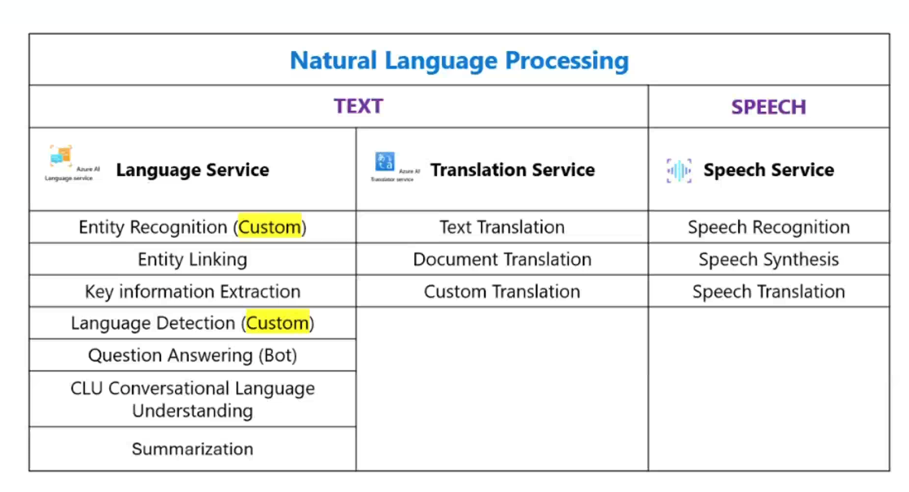

# AI-900 Study Notes - Day 3 - Natural Language Processing (NLP)

## Overview

Azure AI Services: a comprehensive suite of tools and APIs designed to help developers and organizations build intelligent, market-ready applications. These services **provide prebuilt and customizable models**, enabling rapid integration of AI capabilities into applications without requiring extensive expertise in machine learning. They **can be used with a single API and authentication key**, and **provide separate billing for each service if needed**.

Azure AI Language is a part of the Azure AI services offerings that can **perform advanced natural language processing over unstructured text**.

---

## Key Concepts

### Text Analysis

- **Sentiment analysis**: identifies whether text is **positive, negative, or neutral**.
- **Key phrase extraction**: lists the **main concepts from unstructured text**.
- **Language detection**: **identifies the language of the text** and returns a language code such as "en" for English.
- **Named entity recognition (NER)**: identifies **people, places, events**, and more. This feature can also be **customized to extract custom categories**.
- **Entity linking**: identifies known entities together with **a link to Wikipedia**.
- **Summarization**: summarizes text by identifying the most important information.

### Language Understanding

- **Conversational Language Understanding (CLU)**: describes a set of features used to build an **end-to-end conversational application**. It enables you to customize natural language understanding models to predict the overall intention of an incoming phrase and extract important information from it. It uses three building-block concepts:
  - **Utterance**: The **actual text or speech provided by the user**.
  - **Intent**: The **goal or purpose** behind the utterance — the action the user wants to perform.
  - **Entity**: Specific **data points or parameters** extracted from the utterance that give context to the intent.

### Question Answering

- **Question Answering**: typically used to build **bot applications** that respond to customer queries (**Bot Service**). It can generate questions from a knowledge base with sources like **webpages**, **an existing FAQ**, or **manually entered data**. Supports multi-turn conversational flows and deployment as a REST endpoint or bot.

### Translator & Translation Features

- **Azure AI Translator**: a translation service that allows users to **translate text and documents** using a simple REST API call. Supports **real-time translation** between supported languages, **batch/document translation** while preserving structure, **custom translation memory**, and integration with **Azure Blob Storage**.
  - **Text translation**: used for **quick and accurate text translation in real time** across supported languages.
  - **Document translation**: used to **translate multiple documents** while **preserving original document structure**.
  - **Custom translation**: enables customized neural machine translation (**custom dictionary**) or **domain-specific terminology**.

### Speech & Audio

- **Speech Synthesis**: converts text into human-like synthesized speech. Supports **prebuilt neural voices** and creation of **custom voices** tailored to brands or applications.
- **Speech Recognition**: converts **speech to text**; useful for transcribing calls or other audio sources.
- **Speech Translation Service**: supports **real-time translation** of speech into other languages, providing both **speech-to-text** and **speech-to-speech** capabilities.
- **Universal Language Model Speech-to-Text API**: a versatile tool to convert audio into text transcriptions with high accuracy and context understanding; optimized for \*\*dictation and conversational scenarios.
- **Azure AI Speech Service**: comprehensive service that provides **speech-to-text**, **text-to-speech**, **speech translation**, **speaker recognition**, and **voice assistant** capabilities.

### Knowledge Mining & Document Intelligence

- **Knowledge mining** solutions: provide **automated information extraction** from **large volumes of often-unstructured data** and create **searchable indexes (AI Search)**.
- **Document Intelligence**: an information-extraction tool that combines OCR/vision capabilities with NLP to understand **structured documents** like **invoices, IDs, receipts, business cards, or custom document formats**.

---

## Azure Services Summary

| Service                      | Purpose                                                                           |
| ---------------------------- | --------------------------------------------------------------------------------- |
| Azure AI Services            | Suite of **AI tools and APIs** for building intelligent apps                      |
| Azure AI Language            | Advanced **NLP** over **unstructured text** (sentiment, NER, summarization, etc.) |
| Question Answering           | **Knowledge-base** Q&A for bots and endpoints                                     |
| Azure AI Translator          | **Text & document translation**, **custom** translation                           |
| Azure AI Speech              | Speech-to-text, text-to-speech, speech translation, speaker recognition           |
| Document Intelligence        | OCR + NLP for **structured documents**                                            |
| Knowledge Mining / AI Search | **Indexing** and extracting information from **large corpora**                    |

---

## Cheat Sheet

- Azure AI Services — comprehensive suite of AI tools and APIs; single API/key; separate billing per service.
- Azure AI Language — NLP over unstructured text.
- Sentiment analysis — detects positive/negative/neutral tone.
- Key phrase extraction — lists main concepts from text.
- Question Answering — builds bot Q&A from webpages, FAQs, or manual entries; supports multi-turn.
- Language detection — returns language code (e.g., "en").
- Named entity recognition (NER) — finds people, places, events; supports custom categories.
- Entity linking — links identified entities to knowledge sources like Wikipedia.
- Summarization — extracts the most important information from text.
- Conversational Language Understanding (CLU) — end-to-end conversation modeling (utterance, intent, entity).
- Utterance — the user's text or speech input.
- Intent — the action or goal the user wants to perform.
- Entity — data points extracted from an utterance that give context to the intent.
- Azure AI Translator — REST API for text/document translation; real-time, batch, custom translation; Blob integration.
- Text translation — real-time text translation across supported languages.
- Document translation — batch translation preserving document structure.
- Custom translation — customize neural translation with domain-specific terminology.
- Speech Synthesis — text → human-like speech; supports prebuilt and custom voices.
- Speech Recognition — speech → text transcription.
- Speech Translation Service — real-time speech-to-text and speech-to-speech translation.
- Knowledge mining — automated extraction and indexing of unstructured data (AI Search).
- Document Intelligence — OCR + NLP for structured document extraction (invoices, receipts, IDs).
- Universal Language Model Speech-to-Text API — high-accuracy audio → text for dictation and conversation.
- Azure AI Speech Service — umbrella for speech-to-text, text-to-speech, speech translation, speaker recognition, etc.

---

## Key Exam Tips

- Remember the difference: Translator = text/document translation; Speech = audio-focused (STT/TTS/translation).
- CLU requires defining utterances, intents, and entities.
- Question Answering sources: webpages, FAQs, and manual Q&A; supports multi-turn.
- Document Intelligence + Knowledge Mining are used when extracting structured info from large unstructured corpora.
